# 검사 AI 자율 운영 에이전트

**못 잡는 불량의 원인을 스스로 규명하는 Self-Healing Vision Ops**

2026 SK AI 해커톤 · AI Solution 리그 · 팀 「사람이 병목이다」

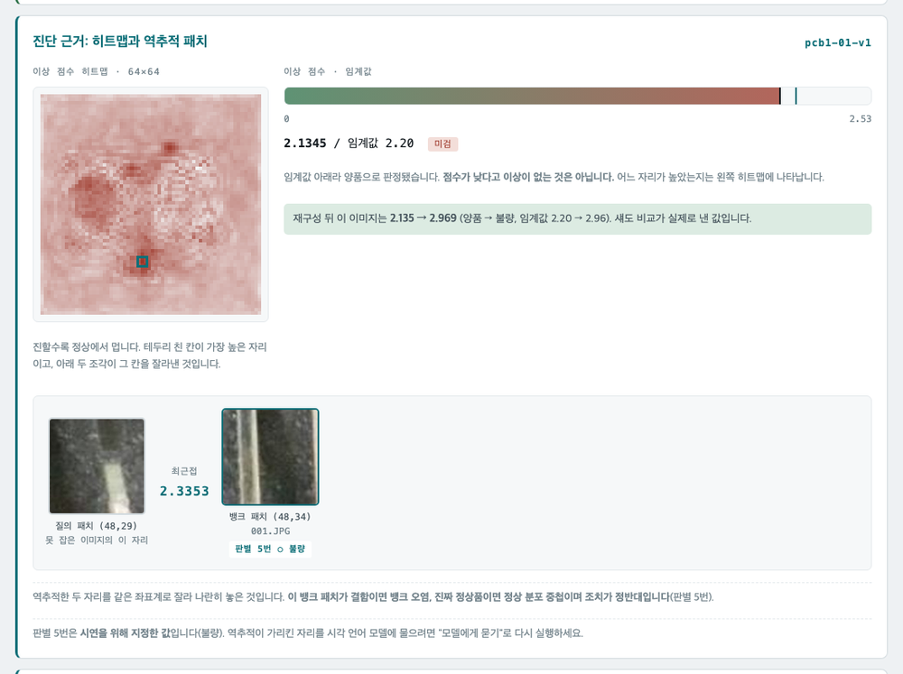

> 못 잡은 이미지가 메모리 뱅크의 **어느 정상 패치와 가까웠는지** 되짚은
> 화면입니다. 왼쪽이 못 잡은 자리, 오른쪽이 뱅크의 그 자리입니다.
> **그 패치가 결함이면 뱅크 오염 하나로 정해지고**, 진짜 정상품이면
> 커버리지 부족·임계값 문제·정상 분포 중첩 중 하나로 갈립니다.
> 실제 실행 화면이며 VisA 공개 데이터셋입니다.

---

## 1. 서비스 개요

제조 현장에 배포된 AI 외관검사 모델이 못 잡는 불량을 만났을 때, 원인 진단부터
데이터 선별과 메모리 뱅크 재구성, 성능 검증, 배포 패키지 생성까지를 에이전트가
스스로 수행합니다.

**검사 모델을 새로 만드는 과제가 아닙니다.** 이미 배포된 모델을 계속 살아
있게 유지하는 운영의 문제를 다룹니다.

---

## 2. 예선 기간 측정 결과

| 확인한 것 | 결과 |
|---|---|
| 실제 언어 모델로 전 구간 실행 | 도구 10개 전부 호출, **호출 순서를 모델이 결정** |
| 진단 규칙의 원인 분류 정확도 | **22/24 (92%)**, 규칙만의 값 |
| 임계값 조정의 한계 | AUROC 1.000에 과검 0%인 뱅크가 **12건 중 0건 검출** |
| 최근접 패치 역추적 | 미검출 12건이 **전부** 혼입 이미지를 지목 |
| 시각 언어 모델 판독 | 자리를 주면 80.8%, 엉뚱한 자리면 11%로 **7.4배 차이** |
| 신구 비교 | 14장 가운데 **사람이 확인할 것은 1장** |

전부 공개 데이터셋(VisA)으로 잰 값이며, 측정 조건은 각 실험 기록에 있습니다.

**규칙 정확도 92%는 이미지와 메모리 뱅크, 조회 계층, 시각 언어 모델을 쓰지
않은 값입니다.** 실제 모델을 통과한 진단 정확도는 본선에서 측정합니다.

---

## 3. 미검출 원인 분류

미검출의 원인은 여섯 가지이고, **그중 넷은 재학습이 답이 아닙니다.**

```mermaid
flowchart TD
    M[미검출 발생] --> D{원인은 무엇인가}
    D --> T[임계값 문제]
    D --> B[뱅크 오염]
    D --> C[커버리지 부족]
    D --> N[정상 분포 중첩]
    D --> E[설비·광학]
    D --> R[기준 문제]

    T --> T2[임계값 재조정<br/>재구성 불필요]
    B --> B2[혼입 제거 후 재구성<br/>재구성 필요]
    C --> C2[해당 조건 정상 추가<br/>재구성 필요]
    N --> N2[기준 재정의·촬영 개선<br/>재구성 효과 없음]
    E --> E2[설비 점검 요청<br/>재구성 차단]
    R --> R2[판정 기준 재정의<br/>재구성 차단]

    style B2 fill:#2d6a4f,color:#fff
    style C2 fill:#2d6a4f,color:#fff
    style T2 fill:#7f1d1d,color:#fff
    style N2 fill:#7f1d1d,color:#fff
    style E2 fill:#7f1d1d,color:#fff
    style R2 fill:#7f1d1d,color:#fff
```

현장에서 미검출이 나오면 가장 흔한 처방이 "학습 데이터를 더 모으자"입니다.
원인이 다른 층위에 있으면 데이터를 아무리 늘려도 해결되지 않습니다.

> **진단 성능의 시험대는 재학습을 해야 할 때 하는가가 아니라,
> 하지 말아야 할 때 멈추는가입니다.**

---

## 4. 진단 원리: 최근접 패치 역추적

PatchCore는 정상 패치를 메모리 뱅크에 담고 최근접 거리로 판정합니다. 그래서
미검출 이미지가 뱅크의 어떤 패치와 가까웠는지를 그대로 되짚을 수 있습니다.
**판단 근거가 모델 안에 이미 있으며, 진단은 추측이 아니라 추적입니다.**

되짚은 패치 하나의 판독이 원인과 조치를 정반대로 돌립니다.

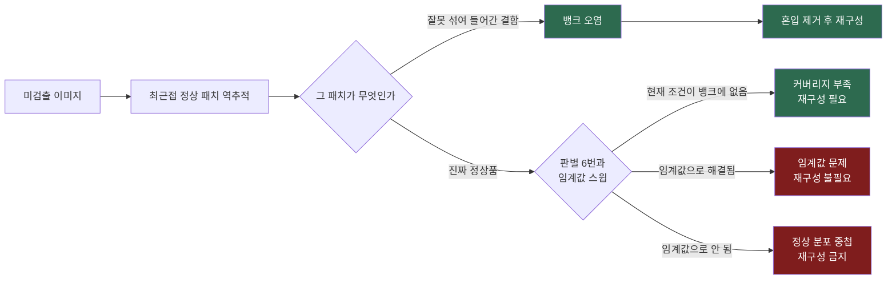

**결함이면 뱅크 오염 하나로 정해집니다.** 진짜 정상품이면 셋으로 나뉘고,
판별 6번과 임계값 스윕이 그것을 가릅니다.

**뱅크 오염과 정상 분포 중첩 두 짝이 조치가 정반대입니다.** 같은 이미지에
같은 이상 점수, 같은 최근접 패치인데 이 판독만 뒤집으면 재구성 지시와
재구성 금지로 갈립니다.

실제 실행에서 확인했습니다. 판별 5번만 바꿔 같은 이슈를 다시 돌린 화면입니다.

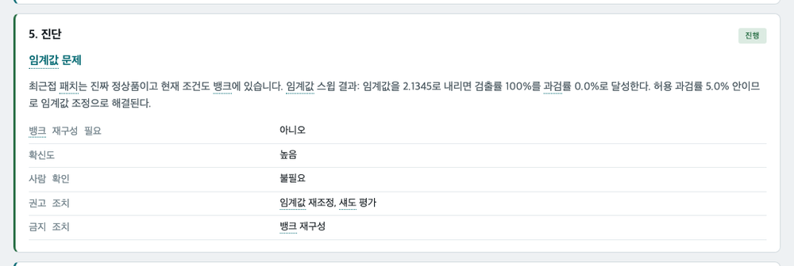

**뱅크 재구성이 금지 조치로 찍히고 진행이 5단계에서 멈춥니다.**

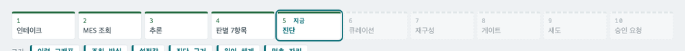

고장이 아니라 결론입니다. **하지 말아야 할 때 멈추는 것**이 이 서비스가
증명하려는 것입니다.

---

## 5. 처리 흐름

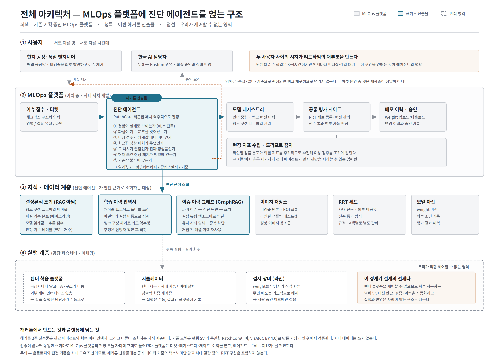


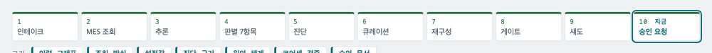

열 단계가 전부 도구 호출입니다. **언어 모델이 어떤 도구를 어떤 순서로 부를지
정하고, 판정 내용은 도구 안의 규칙이 냅니다.** 모델이 순서를 어기면 도구가
거부하고, 계획이 뱅크를 건드리지 않기로 했으면 모델이 재구성을 불러도
실행되지 않습니다.

이슈는 이미지가 아니라 자연어 한 줄로 들어옵니다. 라인과 품목은 언어
모델이 원문에서 뽑고, 모자라면 추측하지 않고 되묻습니다.

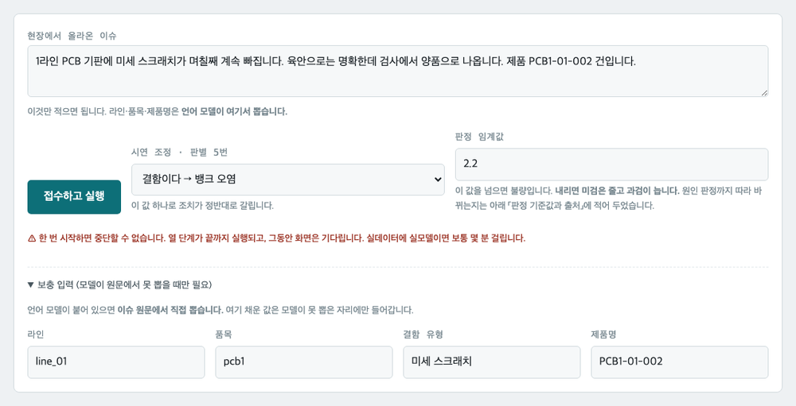

마지막은 승인 요청에서 멈춥니다. 품질 검사 설비의 특성상 무인 배포는
의도적으로 배제했으며, **그 경계를 코드가 지키는지 시험이 강제합니다.**
배포로 읽히는 함수가 생기지 않았는지 코드를 파싱해 검사합니다.

---

### 신구 비교

신규 뱅크를 실제 판정에 쓰지 않고 같은 이미지에 병렬로만 추론시켜,
**판정이 갈리는 건만** 추출합니다. 양산 데이터에는 정답 라벨이 없고,
신규 뱅크를 배포하면 기존 뱅크는 더 이상 동작하지 않아 같은 조건 비교가
불가능하기 때문입니다.

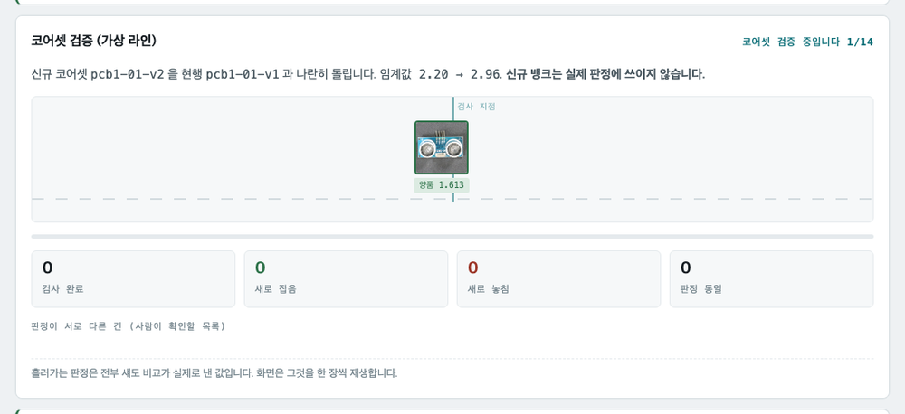

---

## 6. 모델 사용 범위

언어 모델과 시각 언어 모델이 읽는 것은 다섯 군데뿐이고 나머지는 전부 조회와
계산입니다. **이 비중이 뒤집히면 진단이 인상 평가가 됩니다.**

| 입력 | 어디에 쓰는가 | 무엇이 읽는가 |
|---|---|---|
| 이슈 접수 텍스트 | 라인·품목·결함유형·기간 추출 | LLM |
| 이슈 이미지 | 판별 1번, 결함이 실제로 보이는가 | VLM |
| 최근접 패치 크롭 | 판별 5번, 결함인가 진짜 정상품인가 | VLM |
| 진단 근거 묶음 | 리포트 서술 (**판정은 규칙**) | LLM |
| 도구 명세와 관측 | 다음에 어떤 도구를 부를지 | LLM |

정확한 값이 필요한 것은 **임베딩하지 않습니다.** 뱅크 구성 프로파일과 화질
기준 분포, 임계값, 판정 기준, MES는 조인과 집계로 정확히 답할 문제입니다.
그래프 검색은 과거 이슈 이력 하나뿐이고 역할은 중복 차단입니다.

실행 기록을 세어 보면 대부분이 조인이고 그래프 검색은 이력 하나입니다.
"전부 RAG로 찾습니다"가 아니며, **이 구분 자체가 제안의 논거입니다.**

---

## 7. 메모리 뱅크 버전 관리

```
banks/pcb1-01/
  pcb1-01-v1_20260815-2004_cad872/     버전 · 만든 시각 · 설정 지문
  pcb1-01-v2_20260816-1130_7b31e0/
  CURRENT → pcb1-01-v1_20260815-2004_cad872
```

되돌리기는 파일을 옮기는 일이 아니라 가리키는 이름 한 줄을 바꾸는 일입니다.
파일이 움직이지 않으므로 도중에 멈춰도 어느 것이 운영본인지 잃지 않고,
되돌린 뒤에도 새 판이 남아 다시 앞으로 갈 수 있습니다.

**승인 문서에 전환 명령이 실제 폴더 이름으로 찍혀 나갑니다.** 승인한
사람이 그것을 복사해 실행합니다.

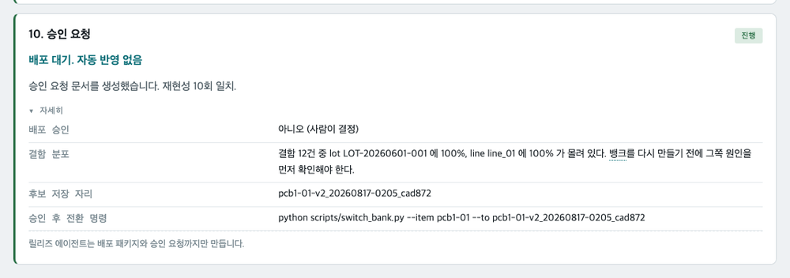

**저장은 자동이고 전환은 사람입니다.** 후보는 성능 검증와 신구 비교를 지난 뒤에만
저장소에 올라가며, 운영본을 가리키는 표시는 코드가 바꾸지 않습니다. 그것을
바꾸는 순간이 곧 배포이기 때문입니다.

폴더 이름의 설정 지문 덕분에 입력 크기를 바꾸면 옛 판이 이름에서 걸러집니다.
실제로 입력 크기를 바꾼 뒤 옛 뱅크가 검사를 통과해 다른 척도로 점수를 내던
일이 있었습니다.

---

## 8. 주요 측정 결과

절반이 우리 가정을 반증한 것입니다.

| 무엇 | 결과 |
|---|---|
| 입력 해상도 **512** | 256/224로는 VisA 결함을 거의 못 잡음 |
| **중앙 크롭 제거** | 결함이 실제로 잘리고 있었음 (pcb3 40건 중 12건) |
| **coreset 증폭** | 끌어올리는 것은 결함이 있는 이미지이지 결함이 아님 (0.3%) |
| **역추적** | 뱅크 오염이 실제로 해를 끼쳤을 때만 짚음 (12/12 대 0/12) |
| **크기 가설 반증** | 가장 작은 결함 7/10, 가장 큰 결함 0/10. 갈리는 축은 배경 복잡도 |
| **프롬프트 개선 무효** | 품목별 어휘를 줘도 +5%p, 과검도 함께 늚 |
| **그림에 자리 표시** | 검출 +14%p에 과검 +30~35%p. 사용 불가 |
| **임계값 스윕의 한계** | 지표는 통과인데 운영 임계값에서 0/12 |
| 자리별 기준선 빼기 | 위치 추정에는 효과 없음. 상위 5자리에서도 5/10 |
| 고립도 | 정밀도 100%, 재현율 10%. 방식이 아니라 조건을 탐 |

측정 조건과 원본 수치는 `docs/실험_*.md` 에 있습니다. **조건 없이 인용하면
안 되는 값이 여럿입니다.** 특히 AUROC는 홀드아웃 구성이 다르면 직접 비교할
수 없습니다.

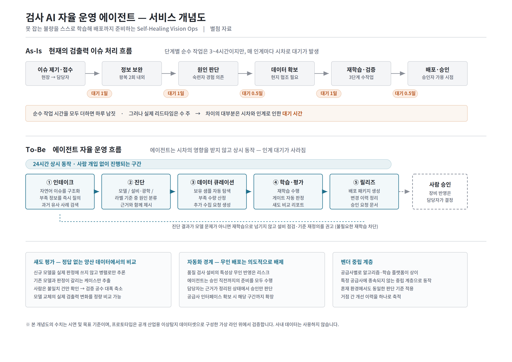

---

## 9. 문서

| 문서 | 무엇을 담는가 |
|---|---|
| [`docs/기획서.md`](docs/기획서.md) | **예선 제출본.** 문제 정의부터 개발 계획까지 |
| [`docs/설명서.md`](docs/설명서.md) | 처음 보는 사람에게, 무엇을 어떻게 하며 한계는 무엇인가 |
| [`docs/문서지도.md`](docs/문서지도.md) | 어떤 변경이 어떤 문서를 낡게 하는가 |
| [`docs/용어사전.md`](docs/용어사전.md) | 과제 고유 용어와 안 쓰기로 한 비유 |
| [`docs/실험_VLM판독.md`](docs/실험_VLM판독.md) | 판별 1번의 병목이 프롬프트인가 위치인가 |
| [`docs/실험_임계값.md`](docs/실험_임계값.md) | 임계값을 옮기면 진단이 어떻게 달라지나 |
| [`docs/실험_pcbAUROC.md`](docs/실험_pcbAUROC.md) | 기판 AUROC와 앞뒤면 교차 |
| [`docs/실험_판별5번.md`](docs/실험_판별5번.md) | 뱅크 패치가 결함인가 정상품인가 |
| [`docs/운영_표준절차.md`](docs/운영_표준절차.md) | 현업에서 어떻게 쓰는가, 사람이 남는 네 자리 |
| [`docs/거버넌스_기록.md`](docs/거버넌스_기록.md) | 무엇을 왜 바꿨는가가 남는가 |

---

## 10. 실행 방법

시연 장비 기준 **Python 3.11** 이며 코드가 3.11을 맞춥니다.

```bash
python -m venv .venv && .venv/bin/pip install -r requirements.txt

.venv/bin/python scripts/run_demo.py                    # 전 구간 한 번
.venv/bin/python -m uvicorn app.main:app --port 8000    # 웹 화면
.venv/bin/python -m pytest tests/ -q                    # 시험
```

**모델이 붙어 있지 않으면 같은 도구를 고정 순서로 재생하고, 화면에 그렇다고
띄웁니다.** 언어 모델을 붙이려면 `SHVO_LLM_PROVIDER` 와 `SHVO_VLM_PROVIDER` 를
설정하고 `scripts/check_models.py` 로 확인하세요.

VisA 원본 이미지와 메모리 뱅크 파일은 저장소에 없습니다. 데이터는
`data/build_factory.py` 로 재현하고 뱅크는 스크립트로 재구성합니다.

저장소를 함께 고치실 분은 [`CONTRIBUTING.md`](CONTRIBUTING.md) 를 보세요.

---

## 11. 범위 제외 항목

- **무인 배포.** 배포 패키지와 승인 요청 문서까지만 만들고 장비 반영은
  사람이 합니다
- **사내 데이터.** 전부 VisA 공개 데이터셋과 직접 만든 가상 데이터입니다.
  실제 공정 조건과 장비 공급사명, 생산 거점, 사내 결함 정의 체계는 코드와
  주석, 문서 어디에도 넣지 않습니다
- **정답 파일 수정.** 진단 정확도가 낮게 나온다고 `data/scenarios.yaml` 을
  고치면 측정 자체가 무의미해집니다
- **MES와 이미지 메타데이터 벡터화.** 조인과 집계로 정확히 답할 문제입니다

---

## 12. 팀 구성

| 역할 | 담당 |
|---|---|
| 에이전트 담당 | LLM·VLM 실행 환경, 오케스트레이션, PatchCore 추론과 역추적, 진단 판정, 데모 |
| 도메인 담당 | 원인 분류 체계, 시나리오와 정답 라벨, 화질 지표와 판정 기준, 채점, 업무 표준화 |
| 데이터 담당 | 가상 공장 스토리지와 MES, 학습 이력 인덱서, 이슈 이력 그래프, 조회 계층, 스케줄러 |

---

## 13. 데이터 출처 및 라이선스

**VisA (Visual Anomaly) dataset**, Zou et al., Amazon Science, ECCV 2022,
[CC BY 4.0](https://creativecommons.org/licenses/by/4.0/).

MVTec AD는 비상업 라이선스이므로 사용하지 않습니다.

라이브러리 목록과 라이선스는 [`THIRD_PARTY.md`](THIRD_PARTY.md) 에 있습니다.
